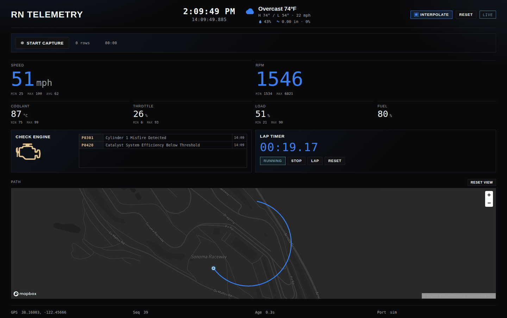

# RN Telemetry

LoRa telemetry from the car (Raspberry Pi) to a laptop base station using **Waveshare USB-TO-LoRa (SX1262)**.

| Side | Path | Role |
|------|------|------|
| Car | [`car/`](car/) | OBD (+ GPS if present) → LoRa TX |
| Base | [`base_station/`](base_station/) | LoRa RX → Node dashboard |

Same `--freq` on both sides. The car finds its LoRa dongle (the only CH343 on the Pi) and, if present at start, the other USB serial adapter as GPS. The base station still wants `/dev/serial/by-id/...` from `npm run list-ports`. Windows base: `COMx`.

<p align="center">
  
</p>

## Car

### First-time setup (Pi)

Do this once. After that, **every reboot auto-starts** telemetry — you do not run `transmit.py` by hand on the car. The first start after boot waits 15s so Bluetooth and the USB dongles can settle.

```bash
cd car
pip install -r requirements.txt
sudo bash pair_obd_bluetooth.sh          # once: pair OBD (adapter powered)
python3 list_bluetooth.py                # scan ~20s, print nearby Bluetooth devices
sudo bash install_service.sh             # enables + starts rnr-obd-bluetooth and rnr-car
```

LoRa is auto-detected (the only CH343). GPS is the other USB serial adapter, if it is present when transmit starts; otherwise a log is written and GPS is not used.

`.python-version` is in the repo root, not `car/`. Re-run `sudo bash install_service.sh` to refresh the units and deps (no uninstall or reboot).

Logs anytime: `journalctl -u rnr-obd-bluetooth.service -u rnr-car.service -f`

Uninstall: `sudo bash uninstall_service.sh` (stops and removes the units; leaves pairing and Python packages).

### SD hardening (optional)

Details: [`car/README.md`](car/README.md).

```bash
sudo bash harden_sdcard.sh && sudo reboot
# before Pi updates, then harden again afterward:
sudo bash unharden_sdcard.sh && sudo reboot
```

### Manual / sim (laptop or debug only)

Not needed on the Pi after setup. Use for bench tests:

```bash
# LoRa is the only CH343. GPS binds if the other USB serial is present.
python3 transmit.py --freq 915 --pwr 22
# Sim OBD: add --sim
```


## Base station

### First-time setup

```bash
cd base_station
cp .env.example .env   # MAPBOX_TOKEN=pk…
npm install
```

### Running

```bash
npm run sim            # no dongle
npm run list-ports     # Linux: by-id · Windows: COMx (list-ports-windows.js)
npm start -- --freq 915 --pwr 22 --lora-port /dev/serial/by-id/...   # Linux
npm start -- --freq 915 --pwr 22 --lora-port COM5                    # Windows
```

Open http://localhost:3000 — details: [`base_station/README.md`](base_station/README.md).

## Protocol

Newline-delimited JSON over LoRa stream mode, 115200 8N1:

```json
{"type":"tel","seq":42,"ts":1725800000,"lat":38.16123,"lon":-122.45456,"speed":75,"rpm":6500,"coolant_temp":92,"throttle":55,"engine_load":70,"fuel_level":40,"mil":true,"dtcs":[{"code":"P0301","desc":"Cylinder 1 Misfire Detected"}]}
```

`speed` is mph. `mil` / `dtcs` from OBD (~5s). Missing sensors are omitted. If no GPS adapter is present at start, `lat`/`lon` are still sent as `null` padded to a typical fix width so the line does not shrink. Both ends reconnect after power-cycle.

## Link rate (SF10 / 125 kHz / 4/5)

TX period is `max(--interval, airtime×1.75 + guard)` (default `--interval` 2.5 s).

| Packet | Size | On-air | Host period | Rate |
|--------|------|--------|-------------|------|
| Typical telemetry | ~206 B | ~1.9 s | ~3.8 s | ~0.26 pkt/s |
| Capped w/ DTCs | ≤240 B | ~2.2 s | ~4.3 s | ~0.23 pkt/s |
